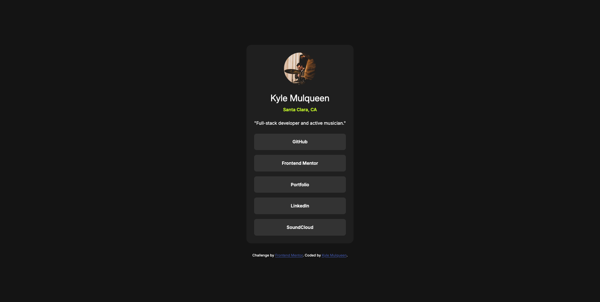

# Frontend Mentor - Social links profile solution

This is a solution to the [Social links profile challenge on Frontend Mentor](https://www.frontendmentor.io/challenges/social-links-profile-UG32l9m6dQ). Frontend Mentor challenges help you improve your coding skills by building realistic projects.

## Table of contents

- [Frontend Mentor - Social links profile solution](#frontend-mentor---social-links-profile-solution)
  - [Table of contents](#table-of-contents)
  - [Overview](#overview)
    - [The challenge](#the-challenge)
    - [Screenshot](#screenshot)
    - [Links](#links)
  - [My process](#my-process)
    - [Built with](#built-with)
    - [What I learned](#what-i-learned)
    - [Continued development](#continued-development)
    - [Useful resources](#useful-resources)
  - [Author](#author)

## Overview

### The challenge

Users should be able to:

- See hover and focus states for all interactive elements on the page

### Screenshot


**Desktop solution**


**Mobile solution**

### Links

- Solution URL: [GitHub Pages](https://kmulqueen.github.io/social-links-challenge/)

## My process

### Built with

- Semantic HTML5 markup
- CSS custom properties
- Flexbox
- Mobile-first workflow

### What I learned

While working on this social links profile challenge, I gained deeper understanding of how to maintain semantic HTML structure while customizing the visual appearance.

One of the key techniques I learned was removing bullet points from list items while preserving their semantic meaning:

```css
.card-links {
  list-style-type: none;
}
```

I also learned how to style anchor tags to remove their default appearance while maintaining accessibility:

```css
.link {
  text-decoration: none; /* Removed underline */
  color: inherit; /* Used parent element's text color */
}

.link:hover {
  color: var(--color-grey-900);
  /* Added custom hover effects for the social links */
}
```

These techniques allowed me to create visually appealing social links while keeping the HTML semantically correct and accessible to all users.

### Continued development

In future projects, I want to explore more advanced CSS techniques for styling interactive elements. Specifically, I'd like to:

- Experiment with more sophisticated hover and focus effects
- Learn how to create custom animated transitions for interactive elements
- Explore CSS Grid for more complex layouts
- Deepen my understanding of accessibility best practices, particularly for interactive components

### Useful resources

- [MDN Web Docs - Styling Lists](https://developer.mozilla.org/en-US/docs/Learn/CSS/Styling_text/Styling_lists) - This helped me understand how to properly style lists while maintaining their semantic structure.
- [Web Accessibility Initiative (WAI)](https://www.w3.org/WAI/tutorials/forms/links/)

## Author

- Website - [Kyle Mulqueen](https://kmulqueen.github.io/portfolio-2025/)
- Frontend Mentor - [@kmulqueen](https://www.frontendmentor.io/profile/kmulqueen)
